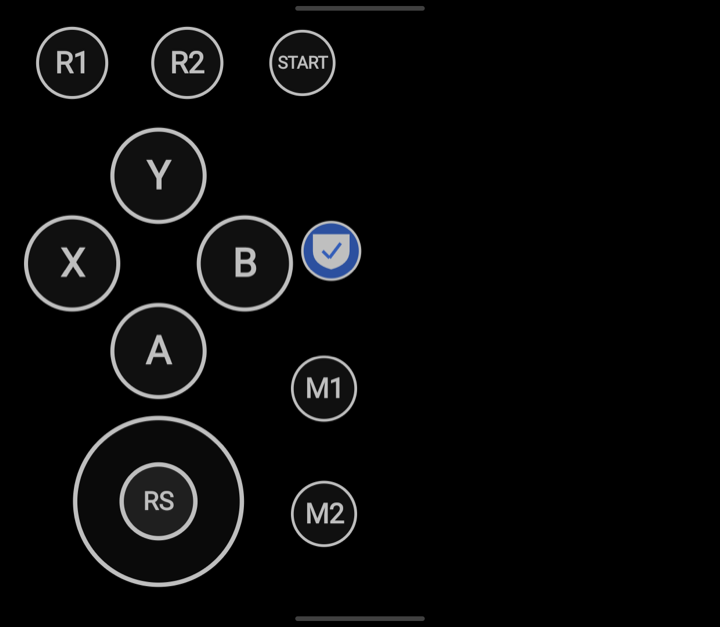
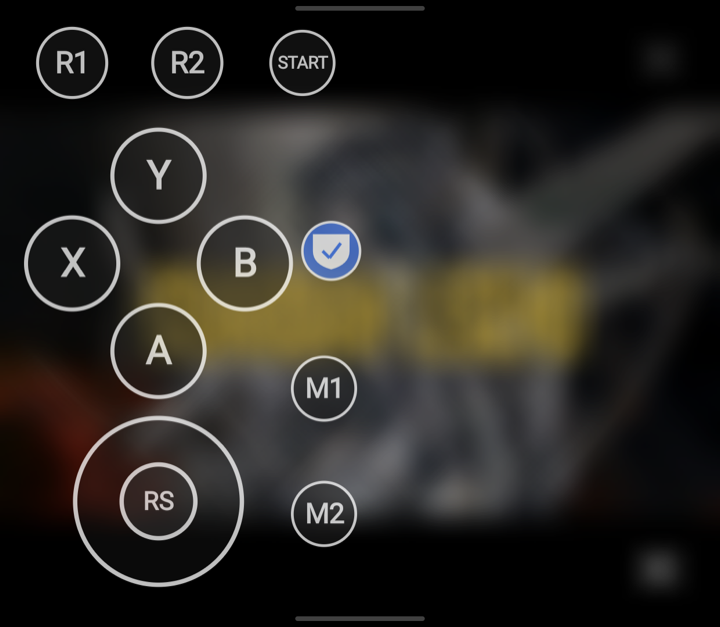

# Thor SidePad

Play one-handed on the AYN Thor. SidePad puts controller buttons on the bottom screen, and
the game on the top screen reads them as presses on the Thor's own controller.

## What it is for

- **One-handed play.** Holding a drink, or just resting the other arm. The buttons your free
  hand would press sit under the thumb you still have on the device.
- **Any button, anywhere.** Put A/B/X/Y, shoulders, triggers, Start, Select, a d-pad or a
  virtual stick wherever your thumb lands. Drag, resize, save it as a preset.
- **Extra buttons the Thor does not have.** M1 and M2 appear to games as two more buttons,
  handy for quick-save, fast-forward or menu shortcuts in emulators.
- **Bluetooth controllers too.** Presses can go into a connected Bluetooth pad instead of the
  built-in one, for the same trick on any controller Android sees.

## What you need

- An AYN Thor. Other dual-screen Android 11+ handhelds should work, with the notes at the end.
- [Shizuku](https://shizuku.rikka.app/), a free app that gives SidePad the access it needs.
  Android does not let one app press buttons for another; Shizuku lends SidePad the same
  access a computer has over USB debugging. SidePad walks you through installing and
  starting it.

## Install

1. Download the latest APK from the Releases page and open it on the Thor. Allow installs
   from your browser or file manager if asked. Obtainium can track releases here for updates.
2. Open Thor SidePad. The setup screen is a short checklist and each step unlocks the next:
   Shizuku, draw over other apps, notifications (optional), Start.
3. Press Start. A short guide appears on the bottom screen and teaches the two gestures by
   having you do them.

## Everyday use

Everything happens on the bottom screen.

- **Pull up from the bottom edge** to show the pad. Pull up again to hide it.
- **Pull down from the top edge** to open the SidePad panel: choose which controller receives
  the presses, show or hide the pad, edit the layout, turn the shield on, pick a backdrop,
  set button transparency, stop SidePad.
- **The shield.** When it is on, nothing behind the pad can be touched by accident, and your
  thumb can slide from one button to the next. When it is off, only the buttons are covered
  and the app under the pad stays usable. There is a shield button on the pad itself.
- **Playing in a dark room.** With the shield on, choose a backdrop: Dim, Dark for a plain
  black bottom screen, or Frosted to blur whatever is behind the pad. The transparency slider
  makes the buttons more see-through.

  
- **Layouts and profiles.** Edit layout opens the editor on the bottom screen: tap a button to
  select it, drag to move, pinch to resize, Add for more buttons or a virtual stick, Delete to
  remove. The chip under the toolbar names the profile you are editing and opens the profile
  picker, where you switch to another profile or make a new blank one. Save writes into the
  profile you are on. Exit leaves, asking first whether to save if there is unsaved work, and
  the back gesture does the same. Switching profile with unsaved work asks too, so nothing is
  lost silently.
- **Device controls on the pad.** Add has pages for Buttons, Sticks, Screen and Sliders.
  The D-pad is one cross you press in any of eight directions.
  Sliders set brightness and volume for each screen, plus one brightness slider that moves
  both screens together; Screen holds Home and Back for either screen and the shield toggle.
  So the things you would reach for the Thor's own keys or the Control Center for are one tap
  from the game.
  Three profiles come built in: Left hand, Right hand and Face buttons. A built-in cannot be
  written over, so saving while on one asks for a name and keeps your copy instead.
- **Holding a button down.** Select a button in the editor and tap Sticky: from then on a
  tap holds it and the next tap lets go. Or add a HOLD button to the pad: tap HOLD, then any
  button, and that button stays down until you tap it again. A held button shows a yellow
  dot. Hiding or stopping the pad releases everything.
- **Glyphs per preset.** The editor's Glyphs button labels the buttons the Xbox, PlayStation
  or Nintendo way. Only the labels change; A is still A to the game.
- **Keep your presets.** The app screen has Export and Import under Presets. Export writes
  your presets and the current layout to a file you choose; Import reads one back. Do this
  before uninstalling, and to carry layouts to another device.
- **Where presses go.** The panel's Controller page lists the Thor's own controller, any
  Bluetooth pad that is connected, and a separate virtual pad that games see as a second
  player.
- **Quick Settings tile** and the notification also show or hide the pad.

## Good to know

- Shizuku stops when the Thor reboots. In the Shizuku app, turn on "Start on boot (wireless
  debugging)" so it comes back on its own; otherwise start it again from the Shizuku app.
  SidePad tells you when Shizuku is not running and opens it for you.
- Switching the Thor's controller style (Standard, Xbox) while playing is fine; SidePad
  follows the change on its own.
- SidePad never reads your controller's buttons, so it does not interfere with key mappers.
- The app icon can be switched between a Famicom and a Game Boy look in the settings.

## Other devices

SidePad was built and tested on the AYN Thor. On another Android 11+ device with a second
touch screen, expect the following:

- Sending presses into a real controller works wherever Shizuku runs.
- The virtual second-player pad needs the device to allow Shizuku access to uinput; many do
  not, in which case only real controllers are offered.
- M1 and M2 depend on the controller advertising two spare buttons; if it does not, they show
  as disabled on the pad.
- The frosted backdrop needs a device that can blur behind windows; otherwise it falls back
  to a heavy dim.

## Built with Claude Code

This app is developed using Claude Code.

## License

MIT. See `LICENSE`. Developer notes are in `DEVELOPMENT.md`.
